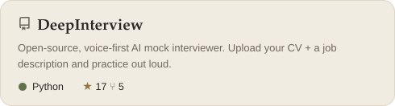
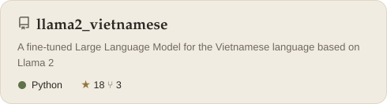
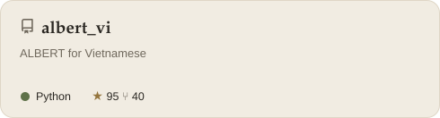
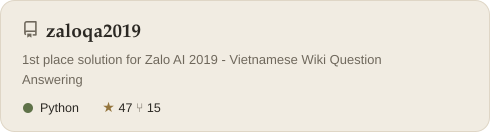
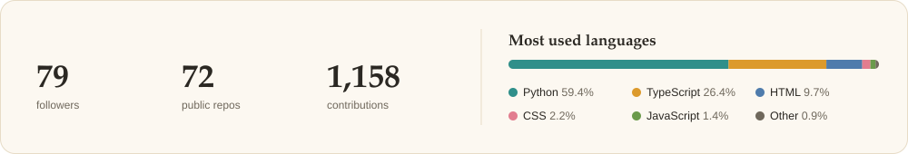

<!-- Profile README for github.com/ngoanpv · assets are animated SVGs in ./assets, live cards refresh daily via .github/workflows/profile.yml -->

<picture>
  <source media="(prefers-color-scheme: dark)" srcset="./assets/banner-dark.svg">
  
</picture>

 

<i>Xin chào — I build AI systems that listen, reason and hold up in production.</i>

<!-- 🎬 Film "Không": open this README in GitHub's web editor and drag film/khong.mp4 here to embed it. -->

 

<picture>
  <source media="(prefers-color-scheme: dark)" srcset="./assets/terminal-dark.svg">
  
</picture>

## How I think about building

- **Start from the pain, not the stack.** A real problem first; the model comes after.
- **One mind becomes many.** An orchestrator that routes to focused sub-agents, each with its own tools — grounded in retrieval that cites its sources.
- **Lighter and faster.** Latency is a feature: caching, routing, quantization, until the conversation feels natural.
- **Measure honestly.** Nothing ships without passing an eval gate — accuracy, faithfulness, latency, safety.
- **Then let it reach everyone.** Company-wide, and in regulated places like banking and healthcare, with a human in the loop.

## The loop

<picture>
  <source media="(prefers-color-scheme: dark)" srcset="./assets/focus-dark.svg">
  
</picture>

## Along the way

- **1st** on two national Vietnamese LLM benchmarks — VMLU and VLSP 2023
- **9th globally** at Interspeech 2025 MLC-SLM — multilingual conversational ASR across 11 languages
- **First in Southeast Asia** to pass iBeta / ISO 30107-3 with *passive* face liveness
- A production voice agent brought from **~5 s to ~2 s** per turn, and LLM review of **100%** of customer calls
- A company-wide **multi-agent knowledge assistant** on hybrid + graph retrieval, with an eval framework gating every release
- Contributor to **Vibe-Trading** — a fix to its multi-turn tool-calling agent loop, and a first backtesting engine for the Vietnamese market

## Currently exploring

<picture>
  <source media="(prefers-color-scheme: dark)" srcset="./assets/exploring-dark.svg">
  
</picture>

- **Simulated crowds** — multi-agent personas built from real people's answers, so a team can try an ad, a price or a policy on a crowd *before* it reaches real users.
- **How reactions spread** — agents with friend networks who only pass something on when they're genuinely convinced, to surface second-order effects.
- **Evals that can say "not sure"** — gates that check agreement with real people (holdout questions, rank correlation, backtests), stability across reruns and bias, and abstain when the evidence isn't there.
- **Benchmarking agents** — measuring how reliable, consistent and well-calibrated LLM agents really are, beyond the demo.

## Open source

<table>
  <tr>
    <td width="50%"><a href="https://github.com/ngoanpv/DeepInterview"><picture><source media="(prefers-color-scheme: dark)" srcset="./assets/generated/repo-DeepInterview-dark.svg"></picture></a></td>
    <td width="50%"><a href="https://github.com/ngoanpv/llama2_vietnamese"><picture><source media="(prefers-color-scheme: dark)" srcset="./assets/generated/repo-llama2_vietnamese-dark.svg"></picture></a></td>
  </tr>
  <tr>
    <td width="50%"><a href="https://github.com/ngoanpv/albert_vi"><picture><source media="(prefers-color-scheme: dark)" srcset="./assets/generated/repo-albert_vi-dark.svg"></picture></a></td>
    <td width="50%"><a href="https://github.com/ngoanpv/zaloqa2019"><picture><source media="(prefers-color-scheme: dark)" srcset="./assets/generated/repo-zaloqa2019-dark.svg"></picture></a></td>
  </tr>
</table>

## Side projects on the App Store

Designed, built and shipped end to end, some of them AI-powered.

<a href="https://apps.apple.com/vn/developer/ngoan-pham-van/id1711897094">
  <picture>
    <source media="(prefers-color-scheme: dark)" srcset="./assets/generated/apps-dark.svg">
    
  </picture>
</a>

<b>Open each app</b>

 

| | App | What it does | Runs on |
|:-:|:--|:--|:--|
|  | [**Mochi — Desk Companion**](https://apps.apple.com/app/id6791887642) | A tiny pixel pet that notices when your day gets heavy | Mac |
|  | [**Mochiba**](https://apps.apple.com/app/id6768528910) | The clock-in app that feels like a friend | iPhone · iPad |
|  | [**HyperLens · Perp PnL Tracker**](https://apps.apple.com/app/id6761550597) | Hyperliquid positions, PnL and alerts in real time | iPhone · iPad |
|  | [**Narabi: Learn Japanese Words**](https://apps.apple.com/app/id6761322457) | Discover hidden connections between Japanese words | iPhone · iPad |
|  | [**MojiZen: Emoji Connections**](https://apps.apple.com/app/id6759525787) | A calm puzzle game about linking emojis | iPhone · iPad |
|  | [**Dhammapada · Kinh Pháp Cú**](https://apps.apple.com/app/id6759248526) | All 423 verses in a calm, practical app | iPhone · iPad · Watch |
|  | [**Shiba Island: Habit Tracker**](https://apps.apple.com/app/id6759195225) | Build healthy habits with a Shiba companion | iPhone · iPad |
|  | [**Lô Tô AI - Số Zì Đây?**](https://apps.apple.com/app/id6758035029) | Vietnamese Lô Tô with a smart AI caller | iPhone · iPad |
|  | [**AI Đu Đỉnh**](https://apps.apple.com/app/id6757269201) | Stock portfolio tracker with a funny AI coach | iPhone · iPad |

## Tools I reach for

<code>Python</code> · <code>PyTorch</code> · <code>LangGraph</code> · <code>vLLM</code> · <code>TensorRT</code> · <code>Langfuse</code> · <code>DeepEval</code> · <code>Neo4j</code> · <code>Qdrant</code> · <code>Kubernetes</code> · <code>TypeScript</code> · <code>Swift</code>

## At a glance

<picture>
  <source media="(prefers-color-scheme: dark)" srcset="./assets/generated/stats-dark.svg">
  
</picture>

<picture>
  <source media="(prefers-color-scheme: dark)" srcset="https://raw.githubusercontent.com/ngoanpv/ngoanpv/output/snake-dark.svg">
  
</picture>

 

<picture>
  <source media="(prefers-color-scheme: dark)" srcset="./assets/stillness-dark.svg">
  
</picture>

slow is smooth · smooth is fast

